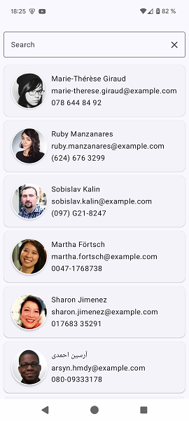
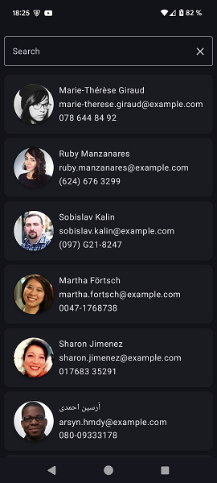
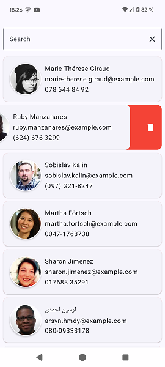
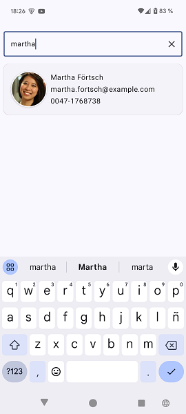

# RandomUsers

A basic master detail Android App using Kotlin, Compose, Room, Paging 3, Ktor and other common libraries

It fetches data from https://randomuser.me/

## Screenshots

<table>
  <tr>
    <td> </td>
    <td></td>
   </tr> 
   <tr>
      <td></td>
      <td></td>
  </tr>
</table>

## Features
* Master / Detail screens with light / dark theme
* Paging
    - It loads data from the backend on demand.
    - Saves paging indices and preferences to `DataStore`
* Database caching
    - Already cached data will not be downloaded again till invalidation (not implemented).
* Filtering
    - Filters data models by `name` or `lastname` or `email`
* Swipe to delete (it actually marks entities as invisible so they may be recoverable)
* Basic error controlling and retry mechanisms
* Unit and Instrumentation tests for `UserViewModel`, `DataStoreManager` and `UserDao`
* Code Coverage for unit tests via Kover

This features are defined inside a layered MVVM UDF architecture.

## Dependencies

### App dependencies and setup

This App was developed with `Android Studio Ladybug Feature Drop | 2024.2.2` and it uses `AGP 8.8.0` and `Gradle 8.10.2`

This App relies in several common libraries on the Android ecosystem mainly provided by Google and Jetbrains.
The process of choosing some of them was influenced by a possible migration to KMP. A simplified list follows:  

Repositories:

* google()
* mavenCentral()
* gradlePluginPortal()

Dependencies:

* AndroidX / Jetpack
    - Core
    - Lifecycle
    - Activity
    - Compose
    - Navigation
    - Room
    - Datastore
    - Paging
    - Koin
* KotlinX
    - Coroutines
    - Serialization
* Coil
* Ktor
* Koin
* Mokkery

### TODO

Write more tests  
Revisit footer when loading  
Revisit UI  
Actually move this to a KMP project  